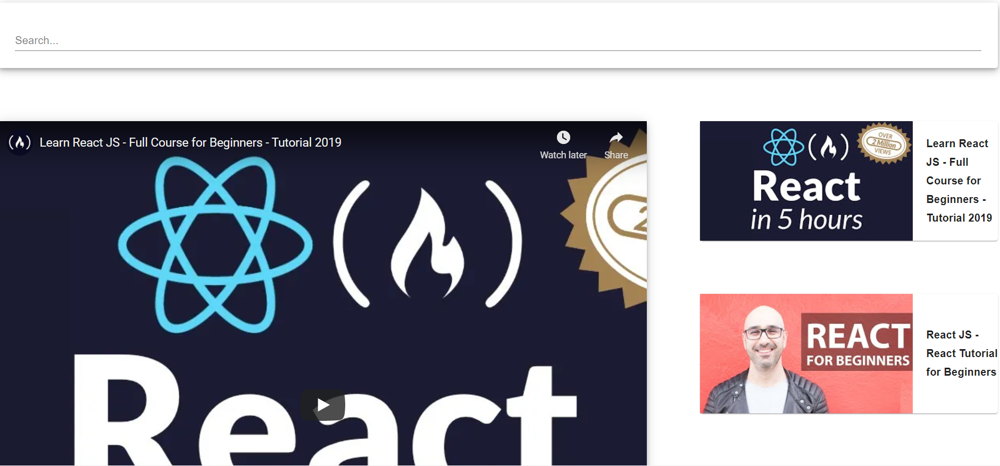
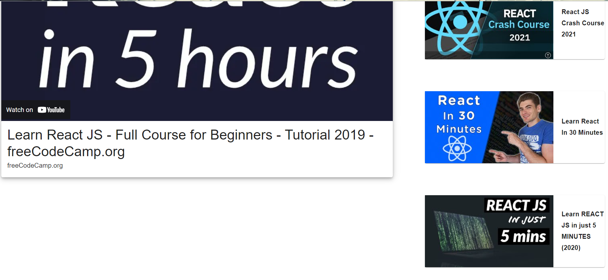

# youtube-clone

I built this really cool basic youtube app that allows the user to search for and play youtube videos based on the Youtube api. It had it's challenges but it was worth it.

## Environment Setup

1. Clone my repo at https://github.com/davidmstanleyjr/youtube-clone

2. CD into it and type "npm install" to install all of the dependencies.
3. Then type "npm start" to run it locally.

## Technologies Used

1. React
2. Material UI
3. Axios
4. React DOM
5. Youtube API

## Issues

Like all of my projects, this one was not without it's issues. To start, the Youtube api was a pain. I had to figure out how to get youtube videos to populate the page and play, as well as how to search for them. The searchbar logic was a pain but I figured it out.

I also had trouble figuring out what would populate the page when the user first goes to the page. I didn't want it to be blank. I solved this by creating a componentDidMount function inside of APP.js and I wrote a string that looked for "learn react js" upon successful loading of the app. Everything else after that was pretty straight forward.

## Screenshots

# Live Page

Here is a link to the deployed site. I hope you have fun with it.
https://davids-youtube-clone.netlify.app/
